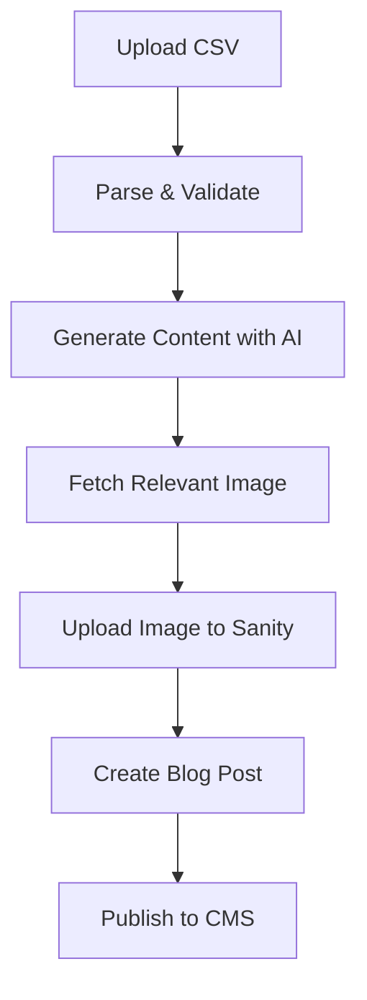

# Blog Generation System

A secure web interface for programmatically generating SEO-optimized blog posts from CSV data, integrated with Sanity CMS, OpenAI for content generation, and Unsplash for relevant images.

## 🚀 Features

- **CSV-Based Input**: Upload CSV files with headlines and key points
- **AI Content Generation**: Uses OpenAI GPT-4 for high-quality, SEO-optimized blog content
- **Automatic Image Fetching**: Finds relevant images from Unsplash based on content
- **Sanity CMS Integration**: Automatically publishes to your existing Sanity setup
- **Secure Admin Interface**: Protected dashboard with authentication
- **Real-time Progress Tracking**: Monitor generation progress with live updates
- **Brand Voice Consistency**: Customized prompts for Convert Labs brand voice
- **Draft/Publish Options**: Choose to publish immediately or save as drafts

## 📋 Prerequisites

Before using the blog generation system, ensure you have:

1. **OpenAI API Access**: Sign up at [OpenAI](https://platform.openai.com/) and get your API key
2. **Unsplash Developer Account**: Register at [Unsplash Developers](https://unsplash.com/developers) for image access
3. **Sanity Write Token**: Generate a token with write permissions in your Sanity project

## 🔧 Setup Instructions

### 1. Environment Variables

Add these variables to your `.env.local` file:

```env
# Blog Generation APIs
OPENAI_API_KEY=your_openai_api_key_here
UNSPLASH_ACCESS_KEY=your_unsplash_access_key_here

# Sanity Write Token (different from read-only tokens)
SANITY_API_TOKEN=your_sanity_api_token_here

# Admin Authentication
ADMIN_USERNAME=admin
ADMIN_PASSWORD_HASH=$2b$12$2/.ppu.g5Uzv.Sojq7hCDuAH01F7uTshO.irzEE4lJIS6UJfjrgau
JWT_SECRET=your-super-secret-jwt-key-change-this-in-production
```

### 2. Generate Admin Password Hash

The default password is `admin123`. To create a new password hash:

```bash
node -e "const bcrypt = require('bcryptjs'); console.log(bcrypt.hashSync('your_new_password', 12))"
```

### 3. Sanity Write Token

1. Go to your Sanity project dashboard
2. Navigate to API → Tokens
3. Create a new token with "Editor" or "Administrator" permissions
4. Copy the token to your `SANITY_WRITE_TOKEN` environment variable

## 📊 CSV Format

Your CSV file should have the following columns:

| Column | Required | Description |
|--------|----------|-------------|
| `headline` | ✅ | The main title/topic for the blog post |
| `key_points` | ✅ | Comma-separated key points to cover |
| `category` | ❌ | Blog post category (defaults to "Web Design") |
| `author_name` | ❌ | Author name (defaults to "Convert Labs Team") |

### Example CSV:
```csv
headline,key_points,category,author_name
"10 Essential Web Design Trends for 2024","responsive design, dark mode, micro-interactions, accessibility","Web Design","Sarah Johnson"
"How to Optimize Your Website for Better Conversions","call-to-action placement, page load speed, mobile optimization","Conversion Optimization","Mike Chen"
```

## 🎯 Usage Guide

### 1. Access the Admin Dashboard

1. Navigate to `/admin` in your browser
2. Login with your admin credentials
3. You'll be redirected to the dashboard

### 2. System Status Check

The dashboard shows the status of all required services:
- **OpenAI API**: Content generation service
- **Unsplash API**: Image fetching service  
- **Sanity CMS**: Content publishing service

All services must show "working" status before generating blog posts.

### 3. Upload and Configure

1. **Upload CSV**: Drag and drop or select your CSV file
2. **Configure Settings**:
   - Default Author: Fallback author name
   - Default Category: Fallback category
   - Publish Immediately: Check to publish, uncheck to save as drafts

### 4. Generate Blog Posts

1. Click "Generate Blog Posts" to start the process
2. Monitor real-time progress in the dashboard
3. View results as each post is processed
4. Check your Sanity Studio for the generated content

## 🔄 Process Flow



## 📝 Generated Content Structure

Each blog post includes:

- **SEO-Optimized Title** (under 60 characters)
- **Meta Description** (150-160 characters)
- **Structured Content** with proper headings (H1, H2, H3)
- **Actionable Tips** and practical advice
- **Call-to-Action** aligned with Convert Labs services
- **Relevant Tags** extracted from key points
- **High-Quality Image** from Unsplash with proper attribution

## 🛡️ Security Features

- **JWT-based Authentication**: Secure session management
- **HTTP-only Cookies**: Protection against XSS attacks
- **Environment-based Secrets**: API keys stored securely
- **Route Protection**: Middleware guards admin routes
- **Input Validation**: CSV structure and content validation

## 🚨 Troubleshooting

### Common Issues:

**"Configuration validation failed"**
- Check that all API keys are correctly set in environment variables
- Verify API keys are valid and have proper permissions

**"CSV parsing error"**
- Ensure CSV has required columns: `headline` and `key_points`
- Check for proper CSV formatting (commas, quotes)
- Verify file encoding is UTF-8

**"Image upload failed"**
- Check Unsplash API key permissions
- Verify Sanity write token has asset upload permissions

**"Blog post creation failed"**
- Ensure Sanity write token has document creation permissions
- Check that author and category references exist or can be created

### Debug Steps:

1. Check browser console for detailed error messages
2. Verify all environment variables are set
3. Test API connections in the System Status tab
4. Review the sample CSV format

## 🔗 API Endpoints

- `POST /api/admin/auth` - Admin authentication
- `DELETE /api/admin/auth` - Admin logout
- `GET /api/admin/validate-config` - Check system configuration
- `POST /api/admin/generate-blog` - Start blog generation
- `GET /api/admin/generate-blog?jobId=xxx` - Check generation progress

## 📁 File Structure

```
src/
├── app/
│   ├── admin/
│   │   ├── login/page.tsx          # Admin login page
│   │   └── dashboard/page.tsx      # Main dashboard
│   └── api/admin/                  # API routes
├── lib/
│   ├── auth.ts                     # Authentication utilities
│   └── blog-generator/             # Core generation logic
│       ├── csv-parser.ts           # CSV processing
│       ├── content-generator.ts    # AI content creation
│       ├── image-fetcher.ts        # Unsplash integration
│       ├── sanity-uploader.ts      # Sanity CMS integration
│       └── types.ts                # TypeScript definitions
└── middleware.ts                   # Route protection
```

## 🎨 Customization

### Brand Voice
Edit the `BRAND_VOICE` constant in `src/lib/blog-generator/content-generator.ts` to customize the AI's writing style.

### UI Styling
The interface uses your existing Tailwind CSS setup and UI components for consistent styling.

### Content Templates
Modify the `BLOG_POST_PROMPT` in the content generator to change the structure and style of generated posts.

## 📈 Best Practices

1. **Content Quality**: Always review generated content before publishing
2. **SEO Optimization**: Use descriptive headlines with target keywords
3. **Image Attribution**: Unsplash images include proper photographer credits
4. **Batch Processing**: Process large CSV files during off-peak hours
5. **Backup Strategy**: Keep copies of your CSV files for regeneration if needed

## 🔄 Updates and Maintenance

- **API Rate Limits**: Monitor usage to stay within API quotas
- **Content Review**: Regularly audit generated content for quality
- **Security Updates**: Keep authentication secrets updated
- **Performance Monitoring**: Check generation times and optimize as needed

## 📞 Support

For issues or questions:
1. Check the troubleshooting section above
2. Review error messages in the dashboard
3. Verify environment configuration
4. Check API service status pages

---

**Note**: This system is designed for Convert Labs' specific brand voice and requirements. Customize the prompts and settings as needed for your use case.
